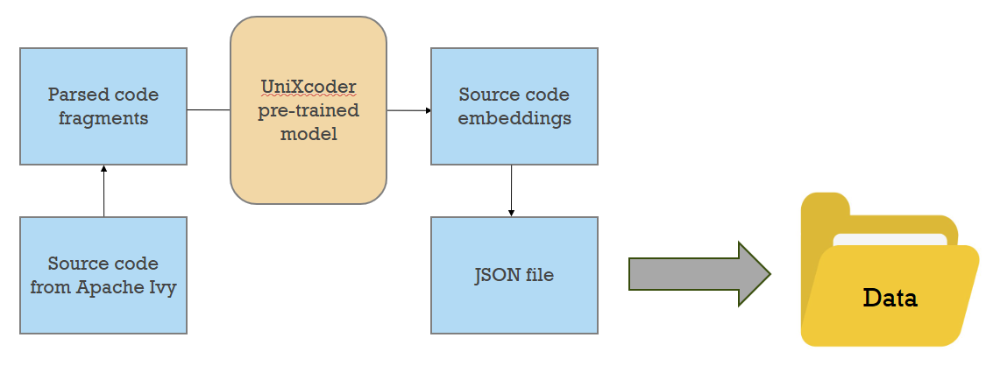

# Topological Data Analysis on Source Code Embeddings

## Overview

Topological data analysis (TDA) is an emerging approach for analyzing complex datasets by extracting shape-based features and structural insights. While TDA has been applied to various domains, its use in studying code is a relatively new and developing area. Still, it shows promise for providing new insights into code structure, quality, and evolution. Although code repositories (i.e., collections of code) contain vast amounts of complex data that can be challenging to analyze using traditional methods, TDA offers a unique perspective by focusing on the topological and geometric properties of data, which can reveal hidden structures and patterns.

One of the foundational elements of TDA is the concept of persistence diagrams, which shows the lifetimes, or the "persistence," of topological features in a dataset as certain parameters change over time. As an example, imagine you're looking at a mountain range from far away. As you get closer, you start seeing different _features_: First, you might see one big mountain. Then as you get closer, you notice there are actually several peaks. Even closer, you might spot valleys and caves. And when you move past them and start moving farther away, the valleys and caves disappear, then the peaks, and finally the mountain. Here, the mountain "persists" the longest, and the valleys and caves the shortest. In the context of topology, data points, when plotted on a point cloud, form shapes that have features such as the number of clusters that form a "shape," as well as the number holes in those shapes. These features are referred to as topological features of the dataset, and are used to determine which datasets are similar or different.

Persistence diagrams summarize the persistences of topological features of a dataset, and they provide a representation of the data's shape. In the context of source code, persistence diagrams can be utilized to analyze the relationships between different components of the codebase, such as classes, methods, and their interactions. This can help in identifying modular structures (i.e., the independent parts of code that define a program's functions) and potential areas for refactoring (i.e., improving the internal code without changing the external functionalities) (Batista et al., 2018).

This repository includes code that can facilitate TDA on Java code from GitHub repositories by data engineering the code into numerical representations of the code, or code embeddings. GitHubFileGetter.py obtains the download URLs of files in a specified repository (or subdirectory in the repository), and CodeEmbeddingsGenerator.py generates a new directory with the code embedding representations. This new directory would be structured similarly to the original repository to make separating embeddings by types and directory locations easier during analyses.

Suppose we want to analyze some Java files in the official Apache Ivy codebase.

Step 1: Obtain the download URLs of the Java files in the repository.
```
import json
from GitHubFileGetter import GitHubFileGetter

# Get the download URLs of all Java files in the ivy subdirectory of the ant-ivy GitHub repository
user = "apache" # Owner of target repository
repo = "ant-ivy" # Repository name
sub_dir = "ivy" # Target subdirectory from within repository
extensions = ["java"] # Specifies to take only .java files

token = "" # Fine-grained GitHub access token (Guide: https://docs.github.com/en/authentication/keeping-your-account-and-data-secure/managing-your-personal-access-tokens)
file_getter = GitHubFileGetter(token)
java_files = file_getter.get_github_files(user, repo, sub_dir, extensions)

# Save URLs in a JSON file
with open(download_urls.json) as f:
  json.dump(java_files, f)
```

Step 2: Generate code embeddings for all files in the repository.
```
import json
from CodeEmbeddingsGenerator import generate_code_embeddings, embed_all_files

java_files = json.load(open("download_urls.json"))
sub_dir = "ivy"

# Generate code embeddings for a single Java file
url = java_files['0'] # The first download URL is the Ivy.java download URL
model = UniXcoder("microsoft/unixcoder-base")
generate_code_embeddings(url, sub_dir, model)

# Generate code embeddings for all the Java files in the ivy subdirectory
embed_all_files(java_files, sub_dir)
```

Step 3: Perform topological data analysis. 

This is where the rest of the magic happens! Perform exploratory data analysis, compute topological features, analyze persistent homology, and more!

Explaining this step is far beyond the scope of this repository, but we have found some helpful links for those who want to have a go:
- Tutorial by Katherine Benjamin: [https://www.youtube.com/watch?v=8qXOdF1_nm8](https://www.youtube.com/watch?v=8qXOdF1_nm8)
- Tutorial by Elizabeth Munch: [https://www.youtube.com/watch?v=SbsvM4Gcbl0](https://www.youtube.com/watch?v=SbsvM4Gcbl0)


## Data Engineering

CodeEmbeddingsGenerator.py reads Java code files, then uses the code to generate code embeddings through a systematic method:

1. Extract code fragments using the [Tree-sitter](https://tree-sitter.github.io/tree-sitter/) parser at three levels: classes, methods, and tokens. The classes are the largest code fragments, which contains the smaller method code fragments, which contains the even smaller token code fragments.
2. Input the code fragments into the [UniXcoder](https://github.com/microsoft/CodeBERT/tree/master/UniXcoder) neural network model for AI code generation, which outputs code fragment embedding representations. Each embedding includes 768 values.
3. Save each embedding as a JSON file in a data folder, along with some other relevant data.
    - Includes the class/method name if it is a class/method embedding, or the token itself if it is a token embedding.
    - Includes the string indices for parsing out the code fragment being represented.

Here is an example data engineering pipeline, where the source code is taken from the official [Apache Ivy](https://github.com/apache/ant-ivy/tree/master) GitHub repository:


Furthermore, the directory in the data folder is structured similarly to the structure of the source repository. JSON files that were created from a certain Java file would be stored in a folder named after that same Java file, which is stored in a location that mimics that of its source. JSON files are also named after the classes or methods they are in, including those that are nested. The idea is to simplify the process of separating embeddings by granularity and directory locations for ease of analysis.

Here are some example JSON filenames that were generated from [Ivy.java](https://github.com/apache/ant-ivy/blob/master/src/java/org/apache/ivy/Ivy.java) (from Apache Ivy):

| Filename | Meaning |
|-|-|
| c.Ivy.json | Class embedding of Ivy class |
| c.Ivy_m.AssertBound.json | Method embedding of AssertBound method found in Ivy class |
| c.Ivy_m.AssertBound_token.json | Token embedding of a token found in AssertBound method and Ivy class |
| c.Ivy_m.AssertBound_token(0).json | Token embedding of a different token found in AssertBound method and Ivy class |
| c.Ivy_m.AssertBound_token(1).json | Token embedding of yet another token found in AssertBound method and Ivy class |
| c.Ivy_m.bind.json | Method embedding of bind method found in Ivy class |
| c.Ivy_m.bind_m.transferProgress.json | Method embedding of transferProgress method found in bind method and Ivy class |
| c.Ivy_m.deliver.json | Method embedding of deliver method found in Ivy class |
| c.Ivy_m.deliver(0).json | Method embedding of a different deliver method found in Ivy class |

## Documentation

### GitHubFileGetter.py

```get_github_files(self, user:str, repo:str, sub_dir:str = '', extensions:list[str]|None = None) -> dict:```

Gets the GitHub download URLs of every file in a specified repository.

Arguments:
- user: The repository owner's GitHub username.
- repo: The name of the repository.
- sub_dir: If a non-empty string, gets all files within the specified sub-directory.
- extension: If not None, gets all files that have one of the specified file extensions.


### CodeEmbeddingsGenerator.py

```generate_code_embeddings(file_url:str, sub_dir:str, model:UniXcoder, device:str = None) -> None```

Uses the pre-trained model to generate code embeddings from the given source code. Gives embeddings for whole classes, whole methods, and tokens, and stores them in a JSON file with relevant data. The data saved in a data folder, and put in a directory that mimics that of the original directory location of the source file.

Arguments:
- file_url: Download URL of a source file.
- sub_dir: The subdirectory of the Github repository from which source code is taken.
- model: UniXcoder transformer model.
- device: PyTorch device.

```embed_all_files(files:dict, sub_dir:str) -> None```

Generates Java code embeddings with the UniXcoder model for every given source code file. It is assumed that all the files are located in the same Github repository and subdirectory.

Arguments:
- files: Download URLs of the Java source code, with uniquely identifying IDs as the keys.
- sub_dir: The specific subdirectory to focus on. If it is an empty string, have no subdirectory to focus on, and organize everything from the master branch.


## References

[1] Batista, N., Sousa, G., Brandão, M., Silva, A., & Moro, M. (2018). Tie strength metrics to rank pairs of developers from github. Journal of Information and Data Management, 9(1), 69. https://doi.org/10.5753/jidm.2018.1637 
